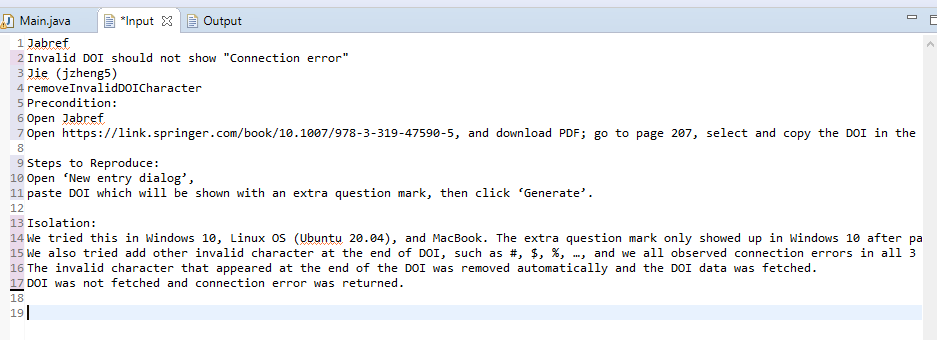
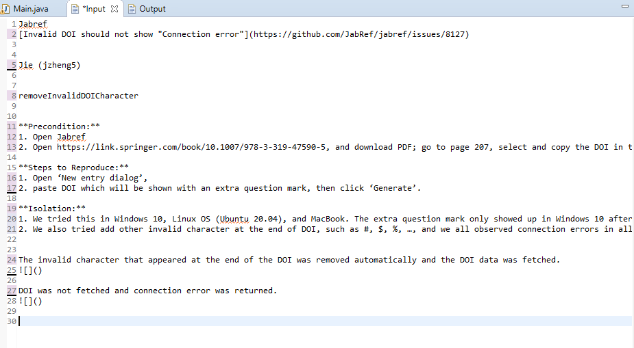
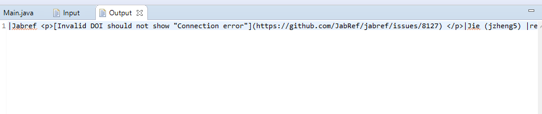

# GoogleTableToMarkdown

This project is intended to assist in copying tables from Google Docs to be used in .MD files

The tables themselves must be set up beforehand, like:

| Table Entry 1 | Table Entry 2 | Table Entry 3 |

followed by:

| --- | --- | --- |

resulting in: 
| Table Entry 1 | Table Entry 2 | Table Entry 3 |
| --- | --- | --- |

Then, you should repeat the following steps:

1. Copy an entire row of elements from the table you wish to copy, paste it into the "Input" file 
2. Format the "Input" file so that 
Each "column" is separated by two lines. There should be no other instance in the file where there are two newline separators unless if you want a new column. One newline is similar to adding new paragraphs

Bold, hyperlinks, underlines, and images are manually added
 
3. Lastly, run the Main classes' main(String [] args) method, with no arguments. This will process the "Input" file and overwrite the contents of the "Output" file, with text that you can then copy + paste into your MD file 

repeat until you are out of rows.
